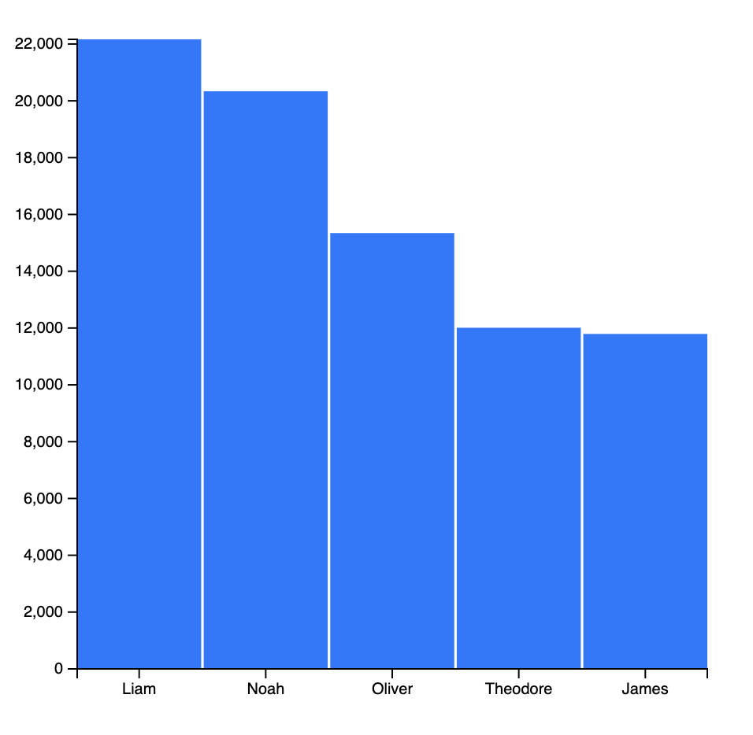

# Creating an Visualization using D3

This bar chart visualization presents the top five baby boy names in 2024. The dataset was obtained from the U.S. Government’s Open Data portal, sourced from the Social Security Administration.

Source: [U.S. Government's Open Data](https://catalog.data.gov/dataset/baby-names-from-social-security-card-applications-national-data?from_hint=eyJzb3J0IjoicG9wdWxhcml0eSJ9)

(Bar Chart presenting Top 5 Baby Boy names in 2024)
