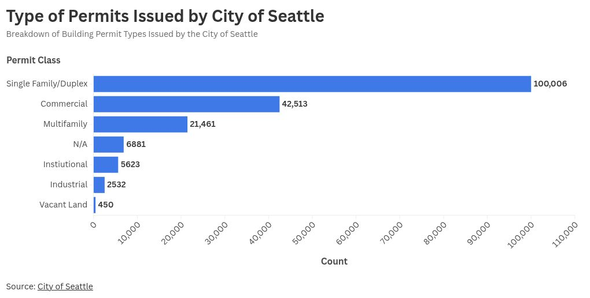

# Flourish 2

The visualization shows the distribution of City of Seattle employees across different departments, illustrating how the city’s workforce is allocated among the various services the local government provides to residents. Each segment represents the proportion of employees working within a specific department, making it easy to compare staffing levels across different areas of city government at a quick glance.

Source: [Seattle Open Data](https://data.seattle.gov/Built-Environment/Building-Permits/76t5-zqzr/about_data)
  

  <a href="https://public.flourish.studio/visualisation/28658123/" target="_blank">
    https://public.flourish.studio/visualisation/28658123/
  </a>

